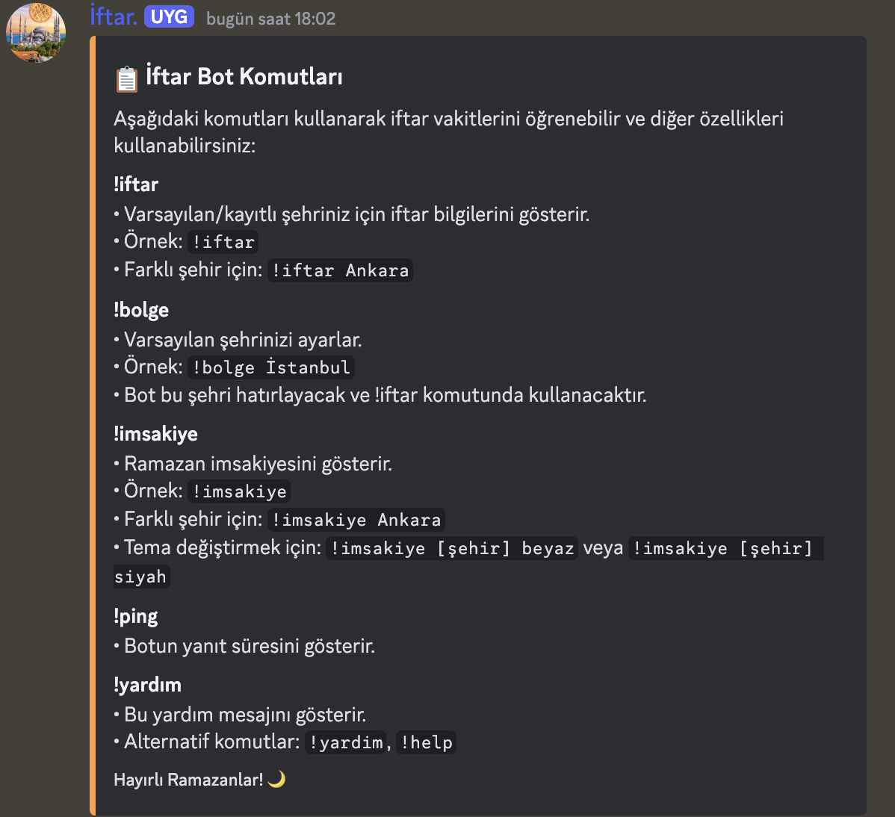
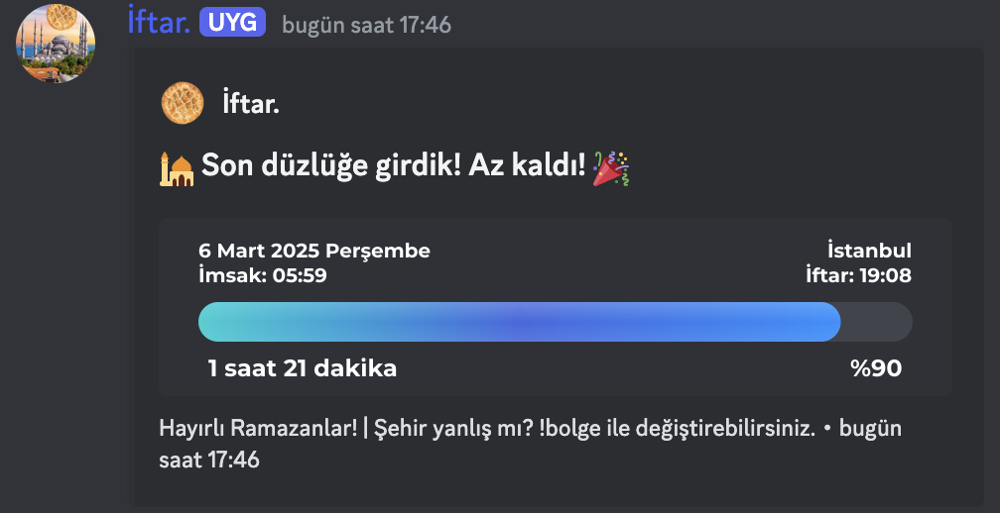

İftar.
=========================
**İftara kalan süreyi görmenizi sağlayan Discord botu**

# Özellikler

`!iftar`
* Varsayılan/kayıtlı şehriniz için iftar bilgilerini gösterir.
* Örnek: `!iftar`
* Farklı şehir için: `!iftar Ankara`

`!bolge`
* Varsayılan şehrinizi ayarlar.
* Örnek: `!bolge İstanbul`
* Bot bu şehri hatırlayacak ve `!iftar` komutunda kullanacaktır.

`!imsakiye`
* Ramazan imsakiyesini gösterir.
* Örnek: !imsakiye
* Farklı şehir için: `!imsakiye Ankara`
* Tema değiştirmek için: `!imsakiye [şehir] beyaz` veya `!imsakiye [şehir] siyah`

`!ping`
* Botun yanıt süresini gösterir.

`!yardım`
* Bu yardım mesajını gösterir.
* Alternatif komutlar: `!yardim`, `!help`

**Developer Özel Komutlar:**
`!karaliste`
* Etiketlenen kullanıcının botu kullanmasını önler.

`!destroy`
* Client'ı yok eder.

# Kurulum
* Öncelikle tabii ki de kodu indirin ve bir klasöre çıkarın
* Buradan [Node.js indirin](https://nodejs.org/tr).
* Kodun bulunduğu klasörde **cmd** veya **powershell** açın
* `.env` dosyasındaki **DISCORD_TOKEN=** satırında ='in yanına Discord Bot tokeninizi girin (Bot tokeni almak için, [Discord Developer Portal](https://discord.com/developers/applications))
* `npm install` komutunu çalıştırın
* Kurulum tamamlandıktan sonra `node index.js` komutunu çalıştırın ve bot çalışmaya başlayacaktır.

Eğer kendinizi Developer moduna geçirmek istiyorsanız `index.js` dosyasındaki **577**. ve **708**. satırdaki **BURAYI_DEGISTIRIN** kısmını Discord kullanıcı ID'niz ile değiştirin.

### Bu proje GPL 3.0 Lisansı kullanır. Eğer forklarsanız projenizi açık kaynaklı yapmak zorundasınız.

korna.
